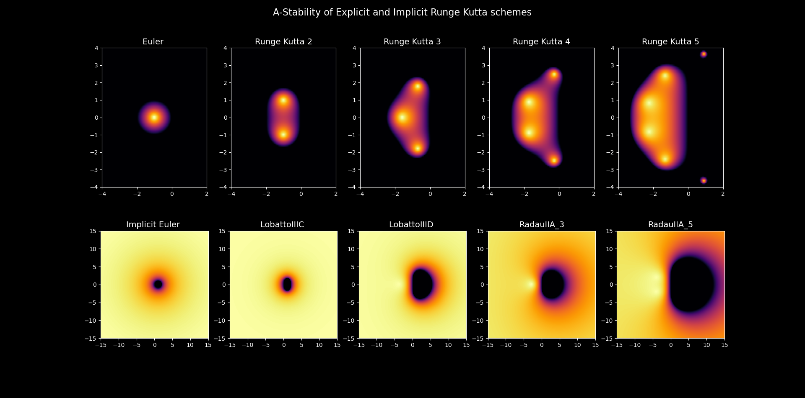

# Problema de los n cuerpos
Integra las ecuaciones diferenciales de gravitación acopladas para N cuerpos

## Caracteristicas

Para mas información leer docstrings

- Integración de ecuaciones mediante Runge kutta, que acepta métodos Implicitos y Explicitos dada una butcher_tableau
- Integracion por verlet en velocidad con paso fijo
- rkn.py Incorpora Stability_Function que evalua la estabilidad lineal de cualquier metodo dada la butcher_tableau

- Se incorporan varias orbitas o coreografias estables

- Se genera un gráfico de la energía mecanica total

- Se creó una función que transforma de Sistema Internacional a Unidades Naturales (geometrodynamic)
- Se Implementó una Simulación del Sistema Solar a partir de datos orbitales en el Perihelio, Algunas consideraciones
    - La simulacion no pretende ser precisa, solamente se presenta de manera explicativa
    - No se toma en cuenta la inclinacion orbital, afectando la precision de la orbita de mercurio
    - Se desprecia el efecto gravitacional de las lunas y cinturones de asteroides

## Referencias
- R. Broucke, D. Boggs, On relative periodic solutions of the planar general three-body problem, Celest. Mech. 12, 439 (1975).
- X. Li, S. Liao, More than six hundred new families of Newtonian periodic planar collisionless three-body orbits, Science China-Physics, Mechanics & Astronomy, Vol. 60, No.12, 129511 (2017).
- X. Li, Y. Jing, S. Liao, The 1223 new periodic orbits of planar three-body problem with unequal mass and zero angular momentum, Publications of the Astronomical Society of Japan, (published online, 2018).
- Datos orbitales obtenidos de - https://nssdc.gsfc.nasa.gov/planetary/factsheet/
- Alan L. Myers, "Natural units of general relativity", (2016) - https://www.seas.upenn.edu/~amyers/NaturalUnits.pdf
- Rajihy, Yasen & Mechee, Mohammed. (2017). Generalized RK Integrators for Solving Ordinary Differential Equations: A Survey & Comparison Study. Global Journal of Pure and Applied Mathematics. 13. 2923-2949.